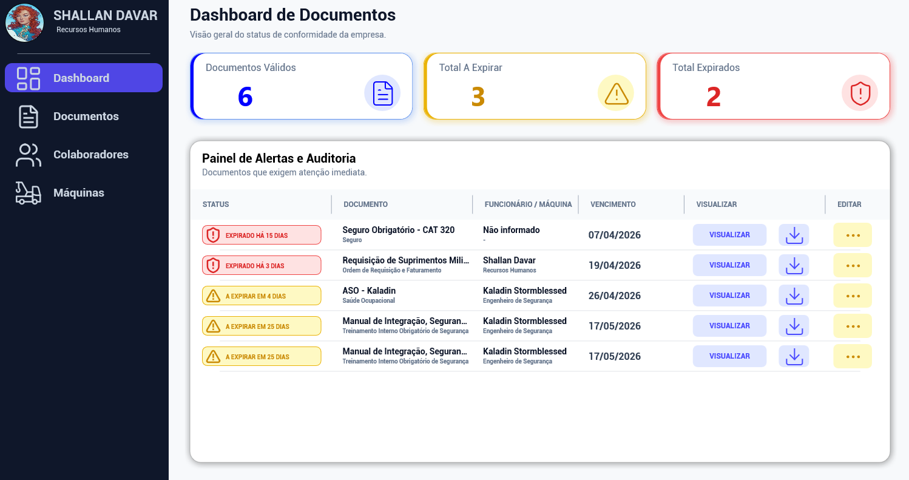
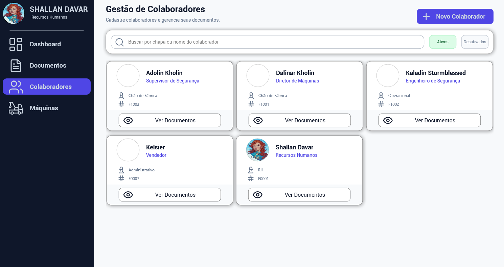
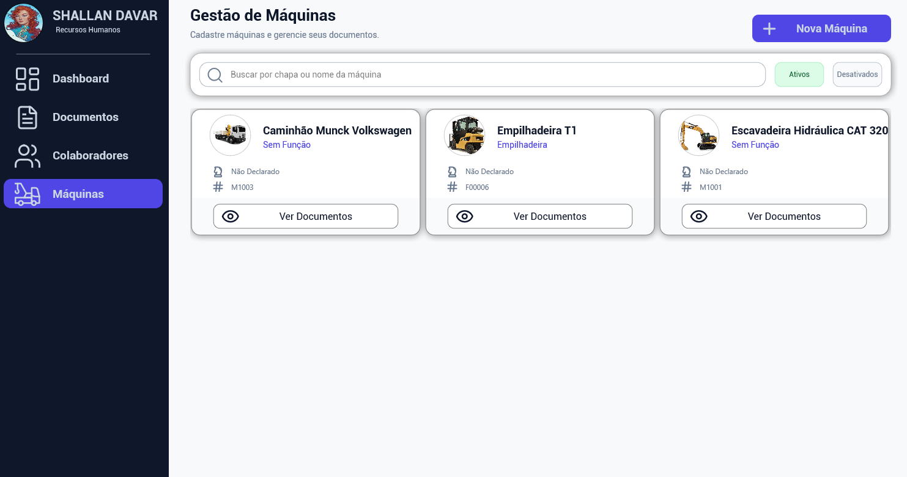
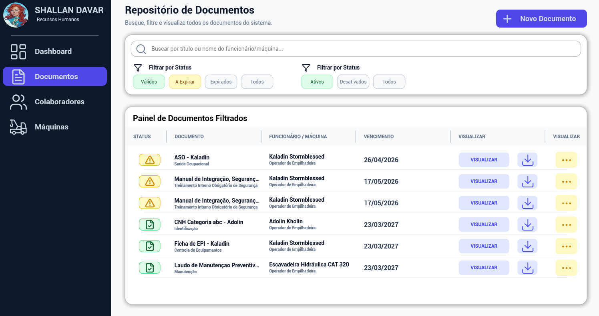

# Projeto Athena

Um sistema de gestão corporativa moderno, escalável e multiplataforma. Focado na administração de recursos humanos, controle de maquinário e gerenciamento inteligente de documentos.

O Projeto Athena adota uma arquitetura robusta, dividindo-se entre uma aplicação cliente nativa desenvolvida em Delphi 10.3 Rio (FireMonkey) e uma API RESTful de alta performance em Node.js.

## Telas do Sistema

Abaixo você encontra as interfaces principais do sistema, demonstrando o design system próprio e a fluidez da plataforma FireMonkey.

### 1. Dashboard Interativo

Visão Geral: Painel central com métricas, alertas em tempo real e status geral da operação, permitindo uma tomada de decisão rápida.

 

### 2. Gestão de Colaboradores

Módulo RH: Controle detalhado de funcionários, equipes e visualização em formato de lista (Cards) para facilitar a busca e edição.

 

### 3. Gerenciamento de Máquinas

Controle de Ativos: Cadastro, monitoramento e atualização de status do parque de máquinas e equipamentos da empresa.

 

### 4. Controle de Documentos (GED)

Gestão de Arquivos: Interface dedicada para upload, visualização segura e organização de documentos diretamente integrados à nuvem/servidor.

 

## Arquitetura e Tecnologias

O projeto é estritamente dividido em dois ambientes principais, garantindo segurança e escalabilidade.

### Front-end (App Client)

Framework: Embarcadero Delphi 10.3 Rio (FMX - FireMonkey).

Interface (UI/UX): Menu **(uMenu.pas e uMenuMobile.pas)** customizado via Design System **(uDesignSystem.pas)**, construído com Frames e Cards dinâmicos.

Inteligência Artificial: Módulo de integração com APIs de IA (Gemini) via uGemini.pas.

Comunicação REST: Utilitários isolados para requisições HTTP (uRequests.pas).

### Back-end (API Server)

Ambiente: Node.js + Express.

Banco de Dados: MongoDB (com Mongoose ODM).

Armazenamento: Integração com o middleware Multer para upload físico de documentos.

Automação: Serviços agendados via Node-cron **(services/cron.js)**.

## Como Executar o Projeto

Siga os passos abaixo para preparar o ambiente de desenvolvimento local.

### 1. Inicializando a API (Servidor)

É necessário possuir o Node.js e o MongoDB instalados localmente ou em nuvem.

Navegue até o diretório da API:

<pre>
cd API_Server
</pre>

Instale as dependências do projeto:
<pre>
npm install
</pre>

***(Opcional) Popule o banco de dados com os dados de demonstração:***

<pre>
node seed.js
</pre>

Inicie o servidor:

<pre>
npm start
</pre>

### 2. Compilando o App Cliente (Delphi)

Abra o Delphi 10.3 Rio.

Carregue o projeto acessando File > Open Project e apontando para **App_Client/ProjetoAthena.dproj**.

Verifique o arquivo uConnection.pas ou uParametros.pas para assegurar que a URL da API corresponde ao seu localhost (ex: *http://localhost:3000*).

Selecione a plataforma de destino desejada no Project Manager (Windows de 32/64 bits, Android, etc).

Compile e execute o projeto pressionando F9.

Licença

Consulte o arquivo LICENSE na raiz do repositório para obter detalhes sobre o uso e a distribuição deste código.
